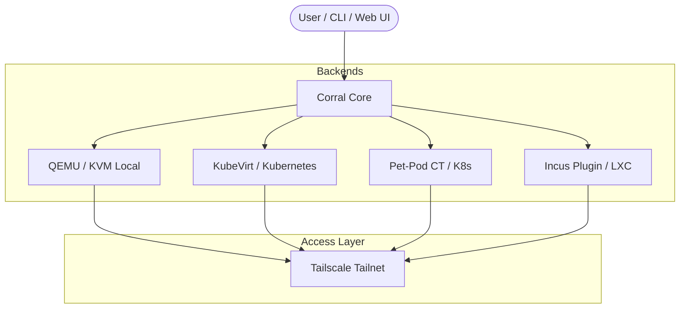

# Corral User Guide & Feature Manual

Welcome to the comprehensive user guide for **Corral** — the unified management platform for virtual machines, pet-pod containers, and local hypervisors.

---

## 1. Overview & Architecture

Corral brings together diverse virtualization and container workloads under a single interface, CLI, and Tailscale network.



### Supported Compute Backends

| Backend | Scope | Tech Stack | Use Case |
|---|---|---|---|
| **QEMU** | Local Host | QEMU / KVM + systemd | Fast, local ephemeral or dev VMs on your workstation |
| **KubeVirt** | Cluster | KubeVirt + Kubernetes | Production VMs with live migration, PVC storage, and scaling |
| **Container (CT)** | Cluster | Kubernetes Pod + PVC | "Pet Pods" — persistent Linux containers (Distrobox on K8s) |
| **Incus** *(Plugin)* | Local Host | Incus / LXC Daemon | Fast, lightweight local containers and VMs via Incus daemon |

---

## 2. Interactive Interfaces

### Web Dashboard

Access the Proxmox-style Web UI at `http://localhost:8006` or via `corral web`.


#### Features:
- **Datacenter Tree**: Navigate through all VMs, CTs, and Incus instances across local and cluster nodes.
- **Live CPU & Memory Sparklines**: Real-time load monitoring per VM.
- **Tag Filtering**: Filter instances by custom tags (`prod`, `dev`, `desktop`).
- **Mobile Responsive**: Manage your VM fleet from your mobile browser.
- **Theme & Branding**: Customize accent colours, header branding, and inject custom CSS — via CLI flags, config file, or the built-in Settings page.


#### Theme & Branding

Corral's web UI accent colour, header branding, and custom CSS are fully
customizable — no source-code changes needed.

**CLI flags** (highest priority, override everything):
```bash
corral web --accent \"#3b82f6\" --brand-title \"My Lab\" --brand-emoji \"⚡\" --brand-subtitle \"Engineering\"
```

**Config file** (`~/.config/corral/config.yaml`, loaded on startup):
```yaml
web:
  accent: \"#22c55e\"        # CSS hex colour
  accent_2: \"#16a34a\"      # hover/active variant
  brand_title: \"My Lab\"
  brand_emoji: \"⚡\"
  brand_subtitle: \"Engineering\"
  custom_css: |
    .btn.primary { border-radius: 20px; }
    .card { background: var(--panel-2); }
```

**Settings page** (web UI → Settings in the sidebar):
- Colour picker with preset swatches (Orange, Blue, Green, Purple, Red, Amber)
- Brand title, emoji, and subtitle fields with live header preview
- Custom CSS textarea that injects styles immediately as you type
- Save button persists to `config.yaml`

Precedence: CLI flags > config.yaml > built-in defaults (🤠 Corral, orange
accent).

---

### Terminal UI (TUI)

Launch the interactive Bubble Tea TUI by running `corral` with no arguments (or explore in demo mode with `corral --demo`).

```
┌─ Corral Datacenter ────────────────────────────────────────────────────────┐
│  NAME            BACKEND    STATUS      PORTS  SPECS          NODE         │
│● web-prod        kubevirt   Running     ●      2 CPU / 4Gi    corral-1     │
│● db-prod         kubevirt   Running     ●      4 CPU / 8Gi    corral-2     │
│● laptop-dev      qemu       Running     ○      2 CPU / 4G     localhost    │
│● test-ct         incus      Running     ○      2 CPU / 2Gi    localhost    │
└────────────────────────────────────────────────────────────────────────────┘
  [enter] actions  [d] doctor  [q] quit
```

#### TUI Keyboard Shortcuts & Features:
- **`[Enter]` Actions Menu**: Opens contextual action menu (Start, Stop, Restart, Pause, Migrate, SSH, VNC Viewer, Delete).
- **`[d]` Doctor View**: Runs full cluster & host diagnostic checks inline within the terminal.
- **Incus & Pet-Pod Integration**: Displays all compute instances (KubeVirt VMs, QEMU local VMs, Pet-Pod CTs, and Incus instances) in a unified Bubble Tea list.

---

## 3. Core Feature Walkthrough

### 1. Instance Lifecycle Management

Create and manage instances across any backend with identical commands:

```bash
# Create local QEMU VM
corral create dev-vm --iso https://example.com/ubuntu.iso --disk 40G

# Create KubeVirt cluster VM
corral create prod-vm --kubevirt --image fedora

# Create Incus container/VM (requires corral-incus plugin)
corral create fast-ct --incus --image images:ubuntu/22.04

# Universal operations
corral start dev-vm
corral stop dev-vm
corral delete dev-vm
```

---

### 2. Remote Access: VNC, RDP & TTY

Corral provides single-command remote access to guest displays and shells:

#### In-Browser & Local VNC


- **VNC Display**: `corral viewer <vm-name>` opens a VNC session. In the Web UI, `noVNC` provides zero-install browser display access.
- **Interactive TTY / SSH**: `corral ssh <vm-name>` or `corral tty <ct-name>` connects your terminal directly into guest shell namespaces (via SSH, `virtctl console`, or `incus exec`).


---

### 3. Bootable Container Images (`bootc`)

Boot containers directly as VMs using the `bootc` plugin:

```bash
corral plugin install bootc
corral bootc create my-node --image quay.io/centos-bootc/centos-bootc:stream9
```

- Builds a bootable OS disk on-cluster using `bootc install to-disk`.
- Upgrade guest OS images using `corral bootc upgrade <vm-name>`.

---

### 4. Proxmox VE API Compatibility Layer

Corral includes a Proxmox VE REST API emulation layer (`/api2/json/...`), allowing Terraform (`bpg/proxmox`), Ansible, and Proxmoxer tools to manage KubeVirt and Incus instances natively.

```bash
corral plugin install proxmox
corral proxmox serve --addr :8006
```

---

### 5. Plugin Marketplace

Expand Corral with lightweight marketplace plugins:

```bash
# Browse marketplace
corral plugin search

# Installed plugins
corral plugin list

# Plugin management
corral plugin install <name>
corral plugin remove <name>
```

#### Available Plugins:
- `incus`: Incus container and VM backend provider.
- `bootc`: Bootable container image VM builder.
- `proxmox`: Proxmox VE REST API compatibility server.
- `backup`: S3/R2 VM disk backup & restore.
- `snapsched`: Automated VM snapshot schedules with retention rules.
- `schedule`: VM autostart and shutdown cron windows.
- `gpu`: GPU / PCI passthrough device plugin discovery.
- `windows`: First-class Windows VM creation (UEFI, TPM, virtio drivers).
- `vdi`: Virtual Desktop Infrastructure desktop pools.

---

## 4. Diagnostics & Troubleshooting

Run `corral doctor` to diagnose cluster capabilities, hypervisor support, and storage drivers:

```bash
corral doctor
```

```
✓ KubeVirt installed (v1.8.2)
✓ CDI containerized data importer available
✓ Default StorageClass supports volume expansion
✓ VolumeSnapshotClass available for backups
✓ QEMU KVM hardware acceleration (/dev/kvm) accessible
✓ Incus daemon socket (/var/lib/incus/unix.socket) active
```
